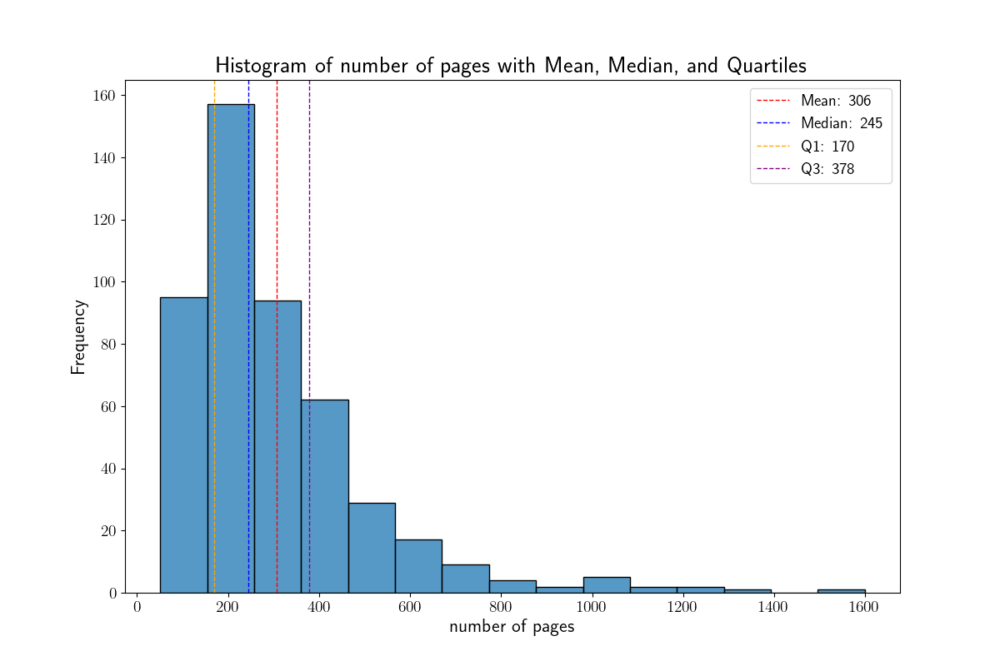

```python
#import the necessary packages
import numpy as np
import pandas as pd
import matplotlib.pyplot as plt
import seaborn as sns


# the code below sets the text to LaTEX font
plt.rcParams['text.usetex'] = True
# the code below sets the default figure and text size for all plots
plt.rcParams['axes.titlesize'] = 20
plt.rcParams['axes.titleweight'] = 'bold'
plt.rcParams['axes.titlecolor'] = 'black'
plt.rcParams['figure.figsize'] = [12, 8]
plt.rcParams['axes.labelsize'] = 16
plt.rcParams['xtick.labelsize'] = 14
plt.rcParams['ytick.labelsize'] = 14
plt.rcParams['legend.fontsize'] = 14

# open the .csv file - the "header=0" part sets the first row as header of the dataframe
df = pd.read_csv('book_list.csv', header=0)
for i in df.columns:
  print("column name: ", i)
# now, I don't want to show the last column, i.e. Unnamed:10 --> I will delete it
df = df.drop(df.columns[-1], axis=1)
df
# morevoer, I want the row index to start from 1 and not from 0
df = df.reset_index(drop=True)
df.index += 1
df
#now I want to extract some information about the number of pages of these books
num_pag = df['# pages'] # I create an array from the column of the panda dataframe df['# pages']
mean_page = num_pag.mean()
median_page = num_pag.median()
quartiles_page = num_pag.quantile([0.25,0.75])
# Plot a histogram of column '# pages'
sns.histplot(df['# pages'], bins=15, kde=False)

# Add lines for mean, median, and quartiles
plt.axvline(mean_page, color='red', linestyle='dashed', linewidth=1, label=f'Mean: {mean_page:.0f}')
plt.axvline(median_page, color='blue', linestyle='dashed', linewidth=1, label=f'Median: {median_page:.0f}')
plt.axvline(quartiles_page[0.25], color='orange', linestyle='dashed', linewidth=1, label=f'Q1: {quartiles_page[0.25]:.0f}')
plt.axvline(quartiles_page[0.75], color='purple', linestyle='dashed', linewidth=1, label=f'Q3: {quartiles_page[0.75]:.0f}')

# add titles
plt.title('Histogram of number of pages with Mean, Median, and Quartiles')
# add labels
plt.xlabel('number of pages')
plt.ylabel('Frequency')
plt.legend()
# Show the plot
plt.show()


# now I want to obtain the same information for the year of publication of these books - at the best of my ability ot retrieve
# the information about the publication year
df['year of publication'] = df['year of publication'].replace(['/', 'V.Y.'], np.nan)
publ_year = df['year of publication']

df['year of publication'] = pd.to_numeric(df['year of publication'], errors='coerce')
publ_year = df['year of publication']

mean_pub_year = publ_year.mean()
median_pub_year = publ_year.median()
quartiles_pub_year = publ_year.quantile([0.25,0.75])
# Plot a histogram of column 'year of publication'
bins_publ_year = [1000,1100,1200,1300,1400,1500,1600,1700,1800,1850,1860,1870,
                  1880,1890,1900,1910,1920,1930,1940,1950,1960,1970,1980,1990,
                  2000,2010,2020,2030]

sns.histplot(publ_year, bins=bins_publ_year, kde=False, color='forestgreen')

# Add lines for mean, median, and quartiles
plt.axvline(mean_pub_year, color='red', linestyle='dashed', linewidth=1, label=f'Mean: {mean_pub_year:.0f}')
plt.axvline(median_pub_year, color='blue', linestyle='dashed', linewidth=1, label=f'Median: {median_pub_year:.0f}')
plt.axvline(quartiles_pub_year[0.25], color='orange', linestyle='dashed', linewidth=1, label=f'Q1: {quartiles_pub_year[0.25]:.0f}')
plt.axvline(quartiles_pub_year[0.75], color='purple', linestyle='dashed', linewidth=1, label=f'Q3: {quartiles_pub_year[0.75]:.0f}')

# add titles
plt.title('Histogram of year of publication with Mean, Median, and Quartiles (all books)')
# add labels
plt.ylabel('Frequency')
plt.legend()
# Show the plot
plt.show()
this is not a very pleasant histogram. let's try to obtain a plot only with the books published starting from 1900.
#####
# filter data for 20th century
publ_year_20th = publ_year[publ_year >= 1900]

bins_publ_year_20th = [1900,1905,1910,1915,1920,1925,1930,1935,1940,1945,1950,1955,1960,1965,1970,
                       1975,1980,1985,1990,1995,2000,2005,2010,2015,2020,2021,2022,2023,2024,2025,2030]
# plot histogram for the 20th century with density normalization
sns.histplot(publ_year_20th, bins=bins_publ_year_20th, stat='density', kde=False, color='forestgreen')

mean_pub_year_20th = publ_year_20th.mean()
median_pub_year_20th = publ_year_20th.median()
quartiles_pub_year_20th = publ_year_20th.quantile([0.25,0.75])

# add lines for mean, median, and quartiles only for books published after 1899
plt.axvline(mean_pub_year_20th, color='red', linestyle='solid', linewidth=1, label=f'Mean (this plot): {mean_pub_year_20th:.0f}')
plt.axvline(median_pub_year_20th, color='blue', linestyle='solid', linewidth=1, label=f'Median (this plot): {median_pub_year_20th:.0f}')
plt.axvline(quartiles_pub_year_20th[0.25], color='orange', linestyle='solid', linewidth=1, label=f'Q1 (this plot): {quartiles_pub_year_20th[0.25]:.0f}')
plt.axvline(quartiles_pub_year_20th[0.75], color='purple', linestyle='solid', linewidth=1, label=f'Q3 (this plot): {quartiles_pub_year_20th[0.75]:.0f}')

# add lines for mean, median, and quartiles for every book
plt.axvline(mean_pub_year, color='red', linestyle='dotted', linewidth=1, label=f'Mean (all books): {mean_pub_year:.0f}')
plt.axvline(median_pub_year, color='blue', linestyle='dotted', linewidth=1, label=f'Median (all books): {median_pub_year:.0f}')
plt.axvline(quartiles_pub_year[0.25], color='orange', linestyle='dotted', linewidth=1, label=f'Q1 (all books): {quartiles_pub_year[0.25]:.0f}')
plt.axvline(quartiles_pub_year[0.75], color='purple', linestyle='dotted', linewidth=1, label=f'Q3 (all books): {quartiles_pub_year[0.75]:.0f}')


# add titles
plt.title('Histogram of year of publication with Mean, Median, and Quartiles (since 1900)')
# add labels
plt.xlabel('Year of Publication (since 1900)')
plt.ylabel('Frequency')
plt.legend()
# Show the plot
plt.show()
books_data_df = df[['# pages', 'year of publication']]
# Create the scatter plot (x-y plot)
sns.scatterplot(data=books_data_df, 
                x='year of publication', 
                y='# pages', 
                hue='year of publication', 
                palette='coolwarm')

# Add labels and a title
plt.xlabel('Year of Publication')
plt.ylabel('Number of Pages')
plt.title('Year of Publication vs Number of Pages')

# Show the plot
plt.show()
books_data_df_20th = df[df['year of publication'] > 1899]
# Create the scatter plot (x-y plot)
sns.scatterplot(data=books_data_df_20th, 
                x='year of publication', 
                y='# pages', 
                hue='year of publication', 
                palette='coolwarm')

# Add labels and a title
plt.xlabel('Year of Publication (since 1900)')
plt.ylabel('Number of Pages')
plt.title('Year of Publication (since 1900) vs Number of Pages')

# Show the plot
plt.show()
```
