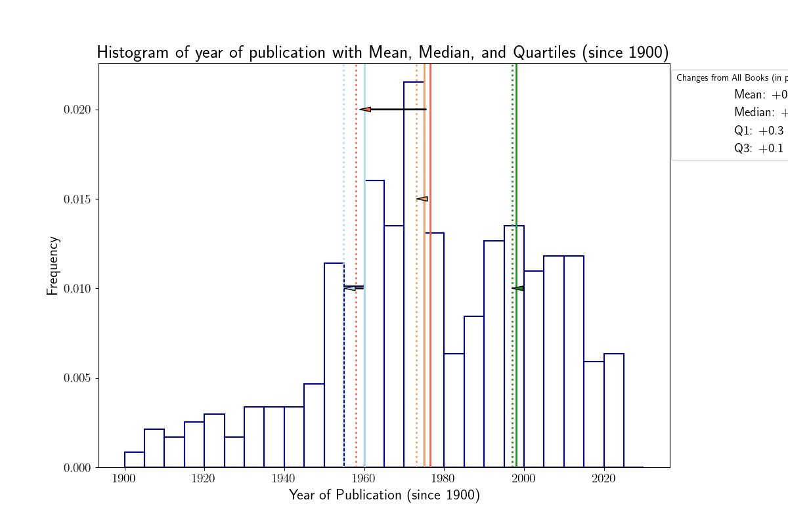
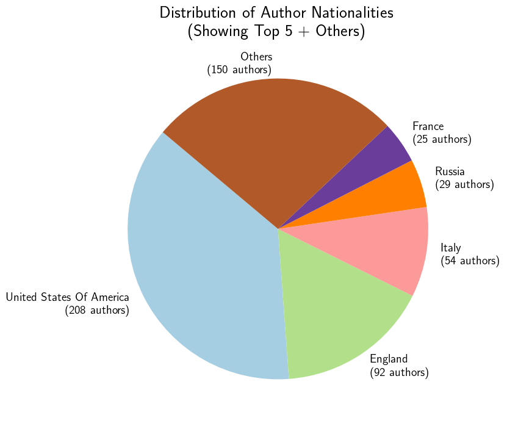

This readme will explain how I obtained the plots and histograms which describe my library of physical books.
I hope you'll enjoy it!


```python
# - # - # - # - # - # - # - # - # - # - # - #
#import the necessary packages
import numpy as np
import pandas as pd
import matplotlib.pyplot as plt
import seaborn as sns

# - # - # - # - # - # - # - # - # - # - # - #
# set the text to LaTEX font
plt.rcParams['text.usetex'] = True
# set the default figure, text size and color
# for ticks and legends
plt.rcParams['axes.titlesize'] = 20
plt.rcParams['axes.titleweight'] = 'bold'
plt.rcParams['axes.titlecolor'] = 'black'
plt.rcParams['figure.figsize'] = [12, 8]
plt.rcParams['axes.labelsize'] = 16
plt.rcParams['xtick.labelsize'] = 14
plt.rcParams['ytick.labelsize'] = 14
plt.rcParams['legend.fontsize'] = 14

# open the .csv file - 
# the "header=0" part sets the first row 
# as header of the dataframe
df = pd.read_csv('book_list.csv', header=0)
# print the column name
for i in df.columns:
  print("column name: ", i)
# now, I don't want to show the last column, 
# i.e. Unnamed:10
# so I will delete it
df = df.drop(df.columns[-1], axis=1)
# morevoer, I want the row index to start 
# from 1 and not from 0
df = df.reset_index(drop=True)
df.index += 1
# now I want to extract some information about 
# the number of pages of these books
num_pag = df['# pages'] 
# mean, median, quartiles
mean_page = num_pag.mean()
median_page = num_pag.median()
quartiles_page = num_pag.quantile([0.25,0.75])
# - # - # - # - # - # - # - # - # - # - # - #
```
First plot! This will show the number of pages
```python
# plot a histogram of column '# pages'
sns.histplot(df['# pages'], bins=15, kde=False)

# add lines for mean, median, and quartiles
plt.axvline(mean_page, color='red', linestyle='dashed', linewidth=1, label=f'Mean: {mean_page:.0f}')
plt.axvline(median_page, color='blue', linestyle='dashed', linewidth=1, label=f'Median: {median_page:.0f}')
plt.axvline(quartiles_page[0.25], color='orange', linestyle='dashed', linewidth=1, label=f'Q1: {quartiles_page[0.25]:.0f}')
plt.axvline(quartiles_page[0.75], color='purple', linestyle='dashed', linewidth=1, label=f'Q3: {quartiles_page[0.75]:.0f}')

# add titles
plt.title('Histogram of number of pages with Mean, Median, and Quartiles')
# add labels
plt.xlabel('number of pages')
plt.ylabel('Frequency')
plt.legend()
# Show the plot
plt.show()
```

```python

# now I want to obtain the same information for the year of publication of these books - at the best of my ability ot retrieve
# the information about the publication year
df['year of publication'] = df['year of publication'].replace(['/', 'V.Y.'], np.nan)
publ_year = df['year of publication']

df['year of publication'] = pd.to_numeric(df['year of publication'], errors='coerce')
publ_year = df['year of publication']

mean_pub_year = publ_year.mean()
median_pub_year = publ_year.median()
quartiles_pub_year = publ_year.quantile([0.25,0.75])
# Plot a histogram of column 'year of publication'
bins_publ_year = [1000,1100,1200,1300,1400,1500,1600,1700,1800,1850,1860,1870,
                  1880,1890,1900,1910,1920,1930,1940,1950,1960,1970,1980,1990,
                  2000,2010,2020,2030]

sns.histplot(publ_year, bins=bins_publ_year, kde=False, color='forestgreen')

# Add lines for mean, median, and quartiles
plt.axvline(mean_pub_year, color='red', linestyle='dashed', linewidth=1, label=f'Mean: {mean_pub_year:.0f}')
plt.axvline(median_pub_year, color='blue', linestyle='dashed', linewidth=1, label=f'Median: {median_pub_year:.0f}')
plt.axvline(quartiles_pub_year[0.25], color='orange', linestyle='dashed', linewidth=1, label=f'Q1: {quartiles_pub_year[0.25]:.0f}')
plt.axvline(quartiles_pub_year[0.75], color='purple', linestyle='dashed', linewidth=1, label=f'Q3: {quartiles_pub_year[0.75]:.0f}')

# add titles
plt.title('Histogram of year of publication with Mean, Median, and Quartiles (all books)')
# add labels
plt.ylabel('Frequency')
plt.legend()
# Show the plot
plt.show()

```

```python

this is not a very pleasant histogram. let's try to obtain a plot only with the books published starting from 1900.
#####
# filter data for 20th century
publ_year_20th = publ_year[publ_year >= 1900]

bins_publ_year_20th = [1900,1905,1910,1915,1920,1925,1930,1935,1940,1945,1950,1955,1960,1965,1970,
                       1975,1980,1985,1990,1995,2000,2005,2010,2015,2020,2021,2022,2023,2024,2025,2030]
# plot histogram for the 20th century with density normalization
sns.histplot(publ_year_20th, bins=bins_publ_year_20th, stat='density', kde=False, color='forestgreen')

mean_pub_year_20th = publ_year_20th.mean()
median_pub_year_20th = publ_year_20th.median()
quartiles_pub_year_20th = publ_year_20th.quantile([0.25,0.75])

# add lines for mean, median, and quartiles only for books published after 1899
plt.axvline(mean_pub_year_20th, color='red', linestyle='solid', linewidth=1, label=f'Mean (this plot): {mean_pub_year_20th:.0f}')
plt.axvline(median_pub_year_20th, color='blue', linestyle='solid', linewidth=1, label=f'Median (this plot): {median_pub_year_20th:.0f}')
plt.axvline(quartiles_pub_year_20th[0.25], color='orange', linestyle='solid', linewidth=1, label=f'Q1 (this plot): {quartiles_pub_year_20th[0.25]:.0f}')
plt.axvline(quartiles_pub_year_20th[0.75], color='purple', linestyle='solid', linewidth=1, label=f'Q3 (this plot): {quartiles_pub_year_20th[0.75]:.0f}')

# add lines for mean, median, and quartiles for every book
plt.axvline(mean_pub_year, color='red', linestyle='dotted', linewidth=1, label=f'Mean (all books): {mean_pub_year:.0f}')
plt.axvline(median_pub_year, color='blue', linestyle='dotted', linewidth=1, label=f'Median (all books): {median_pub_year:.0f}')
plt.axvline(quartiles_pub_year[0.25], color='orange', linestyle='dotted', linewidth=1, label=f'Q1 (all books): {quartiles_pub_year[0.25]:.0f}')
plt.axvline(quartiles_pub_year[0.75], color='purple', linestyle='dotted', linewidth=1, label=f'Q3 (all books): {quartiles_pub_year[0.75]:.0f}')


# add titles
plt.title('Histogram of year of publication with Mean, Median, and Quartiles (since 1900)')
# add labels
plt.xlabel('Year of Publication (since 1900)')
plt.ylabel('Frequency')
plt.legend()
# Show the plot
plt.show()

```

```python


books_data_df = df[['# pages', 'year of publication']]
# Create the scatter plot (x-y plot)
sns.scatterplot(data=books_data_df, 
                x='year of publication', 
                y='# pages', 
                hue='year of publication', 
                palette='coolwarm')

# Add labels and a title
plt.xlabel('Year of Publication')
plt.ylabel('Number of Pages')
plt.title('Year of Publication vs Number of Pages')

# Show the plot
plt.show()

```

```python

books_data_df_20th = df[df['year of publication'] > 1899]
# Create the scatter plot (x-y plot)
sns.scatterplot(data=books_data_df_20th, 
                x='year of publication', 
                y='# pages', 
                hue='year of publication', 
                palette='coolwarm')

# Add labels and a title
plt.xlabel('Year of Publication (since 1900)')
plt.ylabel('Number of Pages')
plt.title('Year of Publication (since 1900) vs Number of Pages')

# Show the plot
plt.show()

```

```python
# Expand the DataFrame to have one nationality per row
# Split the 'nationalities' column by comma and explode into separate rows
df_expanded = df.assign(nationalities=df['nationality'].str.split(' - ')).explode('nationality')

# Remove any extra spaces and convert to lower case for consistency
df_expanded['nationality'] = df_expanded['nationality'].str.strip().str.lower()

# Count occurrences and filter top nationalities
nationality_counts = df_expanded['nationalities'].value_counts()
top_nationalities = nationality_counts.head(5)  # Change 5 to the number of top nationalities you want to display

# Plot pie chart
plt.figure(figsize=(8, 8))
plt.pie(top_nationalities, 
        labels=top_nationalities.index, 
        autopct='%1.1f%%', 
        startangle=140, 
        colors=plt.cm.Paired(range(len(top_nationalities))))
plt.title('Top Nationalities of Authors')
plt.savefig('notebook_images/third_plot.png')
plt.show()
```

```python
# rename columns to avoid LaTeX issues
df = df.rename(columns={'# pages': 'pages', 'year of publication': 'publication_year'})

# Create scatter plot
sns.scatterplot(data=df[['pages', 'publication_year', 'nationality']], 
                x='publication_year', 
                y='pages', 
                hue='nationality', 
                palette="rocket", 
                size='pages', 
                sizes=(50, 500), 
                legend='brief')


plt.legend(loc='upper left', bbox_to_anchor=(1, 1), title='Nationality')
plt.title('Scatter Plot of Number of Pages vs Year of Publication')
plt.xlabel('Year of Publication')
plt.ylabel('Number of Pages')

plt.tight_layout()

plt.savefig('notebook_images/fourth_plot.png')
plt.show()
```

```python
# Filter DataFrame for 20th century
df3_20th = df[df['publication_year'] > 1899]

# Calculate the counts of each nationality
nationality_counts = df['nationality'].value_counts()
sorted_nationalities = nationality_counts.index

# Use the same palette for scatter plot and legend
palette = sns.color_palette("icefire", len(sorted_nationalities))

# Create scatter plot
scatter = sns.scatterplot(data=df3_20th, 
                          x='publication_year', 
                          y='pages', 
                          hue='nationality', 
                          palette=palette,  # Use the same palette
                          size='pages', 
                          sizes=(50, 500))

# Create legend handles based on sorted nationalities and the colors used
handles = [Line2D([0], 
                  [0], 
                  marker='o', 
                  color='w', 
                  label=label,
                  markerfacecolor=palette[i], 
                  markersize=10)
           for i, label in enumerate(sorted_nationalities)]

# Add custom legend to the plot
plt.legend(handles=handles, loc='upper left', bbox_to_anchor=(1, 1), title='Nationalities')

# Add titles and labels
plt.title('Scatter Plot of Number of Pages vs Year of Publication')
plt.xlabel('Year of Publication')
plt.ylabel('Number of Pages')

# Show the plot
plt.savefig('notebook_images/fifth_plot.png')
plt.show()
```

```