# Bookshelf visualizer
## This simple Jupyter Notebook presents a way to visualize relevant information about any bookshelf
- Feel free to customize it for your purposes. 
- Feel free to clone this repository if you want.

The script reads a .csv file, that can be modified accordingly.

You will need to install some packages for the data visualization/analysis parts.

Below there is a small excerpt from the Jupyter Notebook, with some annotations. Please refer to the .ipynb file and not to the text below for the updated and correct code.

```python
# - # - # - # - # - # - # - # - # - # - # - #
# import the necessary package
# set the text to LaTEX font and other graphical tweaks

# open the .csv file - 
```
First plot! This will show the number of pages
```python
# plot a histogram of column '# pages'
sns.histplot(df['# pages'], bins=15, kde=False)
```
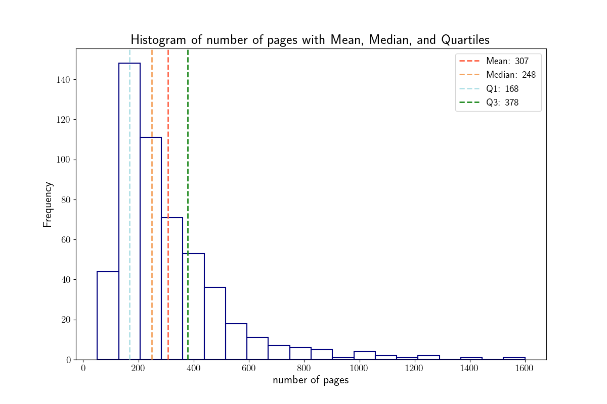
```python

# I now want to obtain the same information for the year of publication of these books,
# at the best of my ability to retrieve them.
# Plot a histogram of column 'year of publication'
sns.histplot(publ_year, bins=bins_publ_year, kde=False, color='forestgreen')
```
Second plot! This histogram shows the year of publication data

```python

This is not a very pleasant histogram. Let's try to obtain a plot only with the books published starting from 1900.
#####
# filter data for 20th century
# plot data
sns.histplot(publ_year_20th, bins=bins_publ_year_20th, stat='density', kde=False, color='forestgreen')
```
Third plot! This histogram shows the year of publication data only for books published since 1900 - you can change this anytime in your code

```python

books_data_df = df[['# pages', 'year of publication']]
# Create the scatter plot (x-y plot)
sns.scatterplot(data=books_data_df, 
                x='year of publication', 
                y='# pages', 
                hue='year of publication', 
                palette='coolwarm')

# Add labels and a title
plt.xlabel('Year of Publication')
plt.ylabel('Number of Pages')
plt.title('Year of Publication vs Number of Pages')

# Show the plot
plt.show()

```
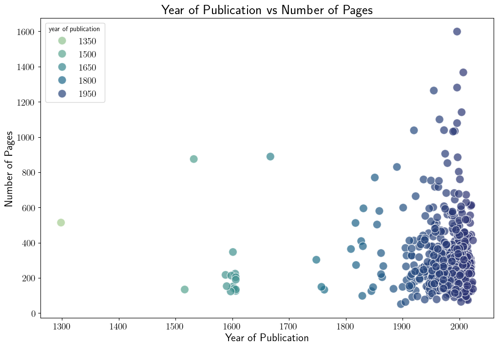
```python

books_data_df_20th = df[df['year of publication'] > 1899]
# Create the scatter plot (x-y plot)
sns.scatterplot(data=books_data_df_20th, 
                x='year of publication', 
                y='# pages', 
                hue='year of publication', 
                palette='coolwarm')

# Add labels and a title
plt.xlabel('Year of Publication (since 1900)')
plt.ylabel('Number of Pages')
plt.title('Year of Publication (since 1900) vs Number of Pages')

# Show the plot
plt.show()

```
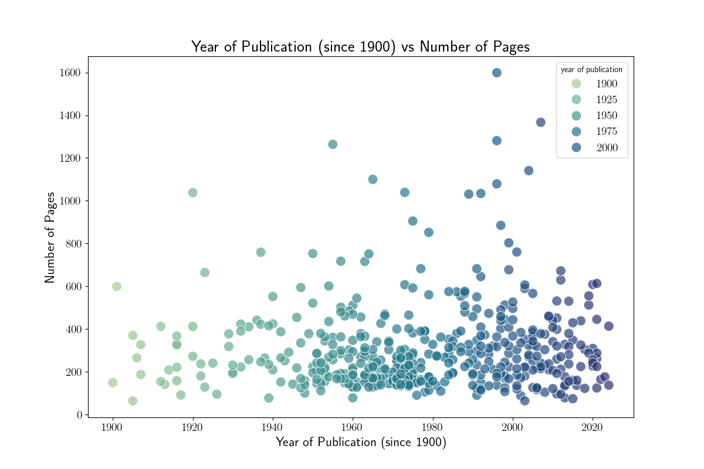
```python
# Plot pie chart
plt.figure(figsize=(8, 8))
plt.pie(top_nationalities, 
        labels=top_nationalities.index, 
        autopct='%1.1f%%', 
        startangle=140, 
        colors=plt.cm.Paired(range(len(top_nationalities))))
plt.title('Top Nationalities of Authors')
plt.savefig('notebook_images/third_plot.png')
plt.show()
```

```python
# rename columns to avoid LaTeX issues
df = df.rename(columns={'# pages': 'pages', 'year of publication': 'publication_year'})

# Create scatter plot
sns.scatterplot(data=df[['pages', 'publication_year', 'nationality']], 
                x='publication_year', 
                y='pages', 
                hue='nationality', 
                palette="rocket", 
                size='pages', 
                sizes=(50, 500), 
                legend='brief')


plt.legend(loc='upper left', bbox_to_anchor=(1, 1), title='Nationality')
plt.title('Scatter Plot of Number of Pages vs Year of Publication')
plt.xlabel('Year of Publication')
plt.ylabel('Number of Pages')

plt.tight_layout()

plt.savefig('notebook_images/fourth_plot.png')
plt.show()
```

```python

# Calculate the counts of each nationality
```

```
#let's create an histogram with the publisher data 
plt.show()
```
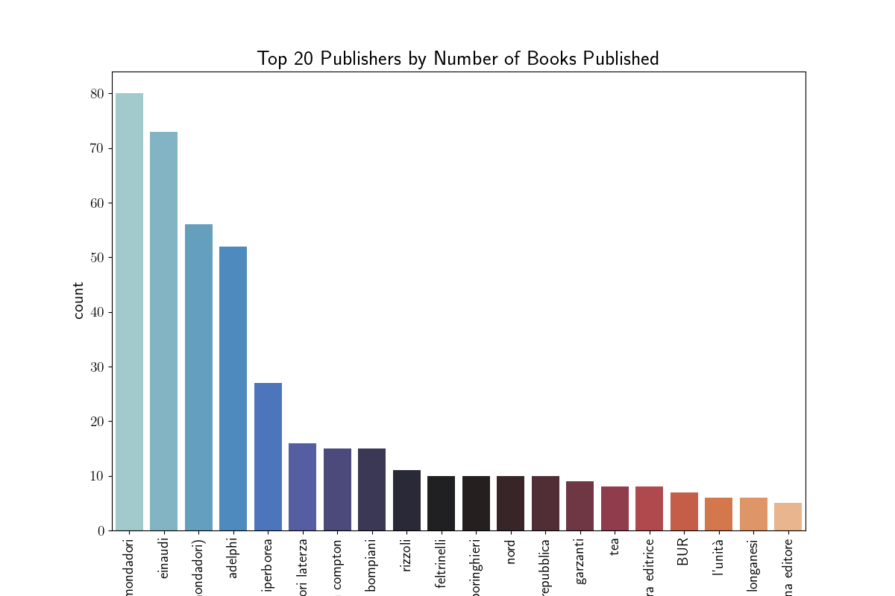
```
```
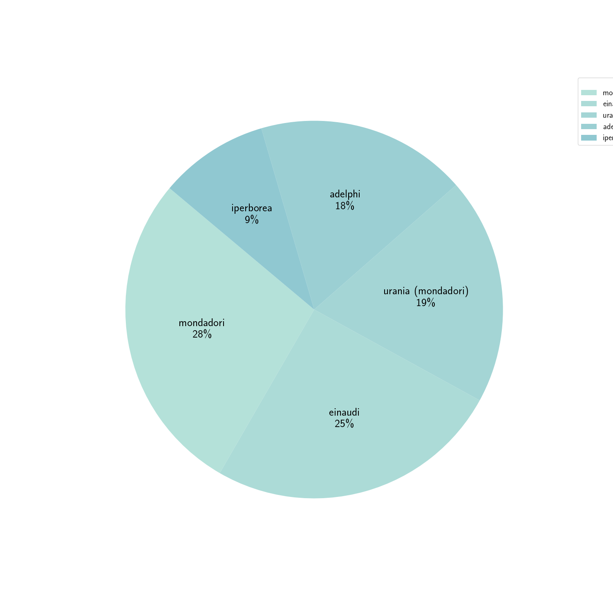
```
# Create a new pie chart with the top 10 authors
# Plot pie chart
plt.figure(figsize=(8, 8))
plt.pie(top_authors, 
        labels=top_authors.index, 
        autopct='%1.0f%%', 
        startangle=140, 
        colors=this_palette)
plt.title('Top Authors')
plt.savefig('notebook_images/pie_chart_author.png')

plt.show()
```
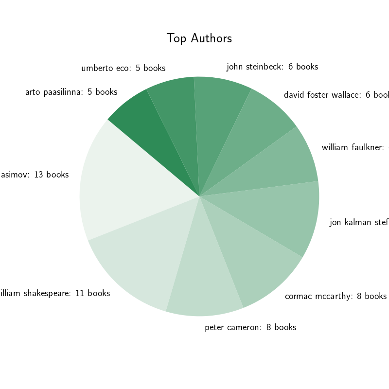
```
World map for the authors
```
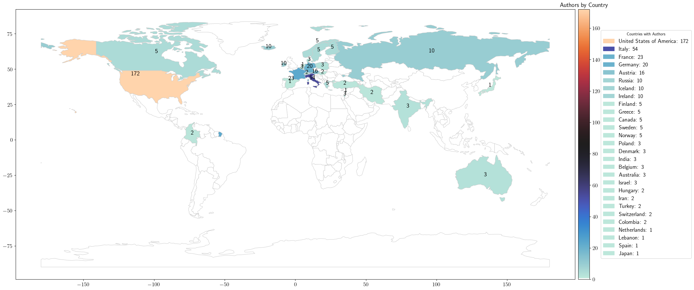
```
Histogram for the total pages written by authors
```
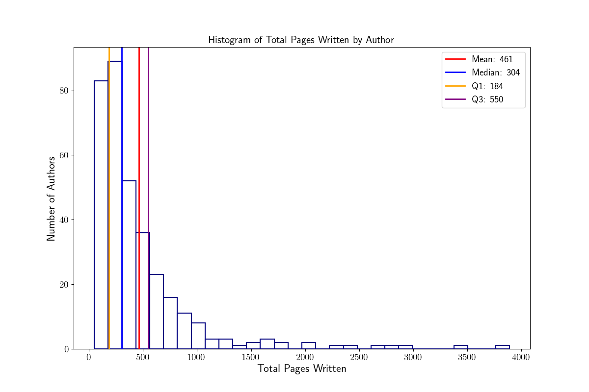
```
Histogram for the 10 most prolific authors
```
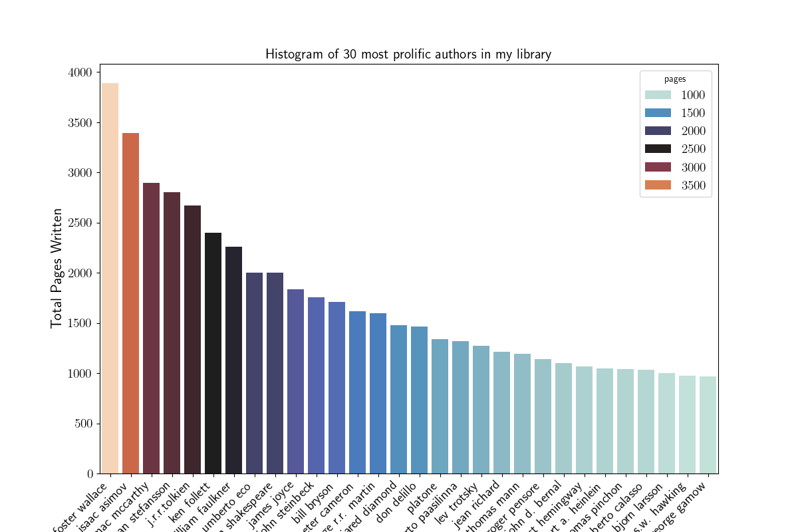
``` 
Histogram for the 10 most prolific authors
``` 
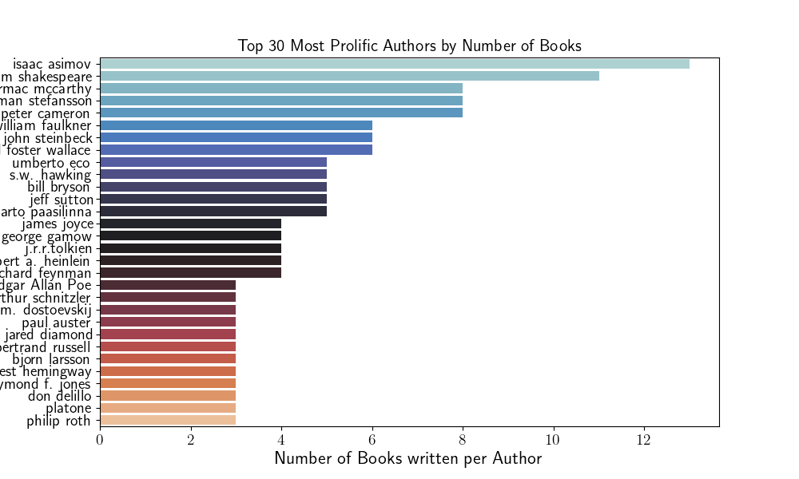
``` 
Timeline of Books Published by Authors with more than one book
```
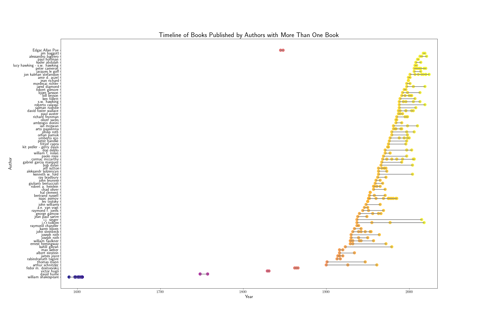
``` 
Timeline of Books Published by Authors with more than one book (Excluding Shared Books)
```

```
Timeline of Books Published by Authors with more than one book (Excluding Shared Books) and divided
```
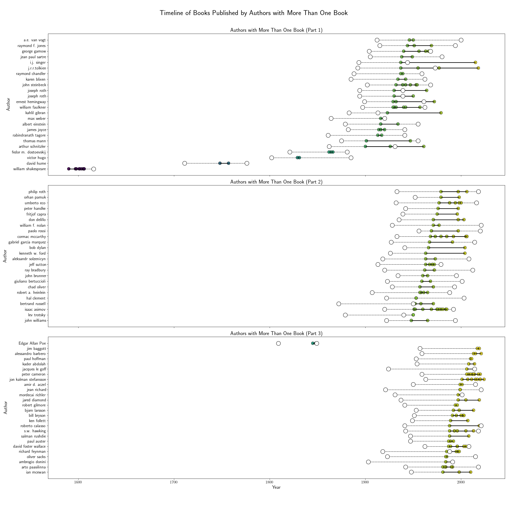
```
Word Visualizer - Book Titles
```
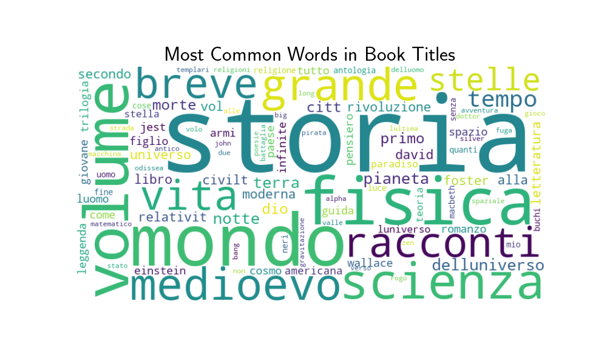
```
Word Histogram - Book Titles
```
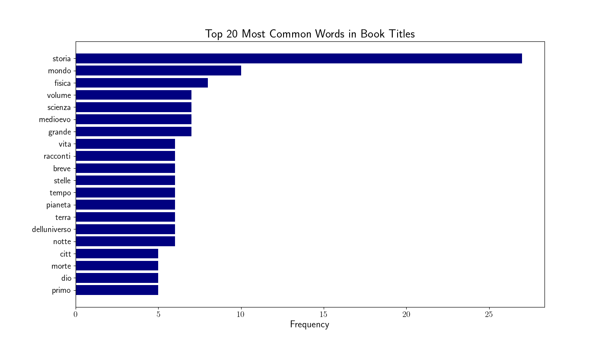
```
Word Histogram - Book Titles
```


